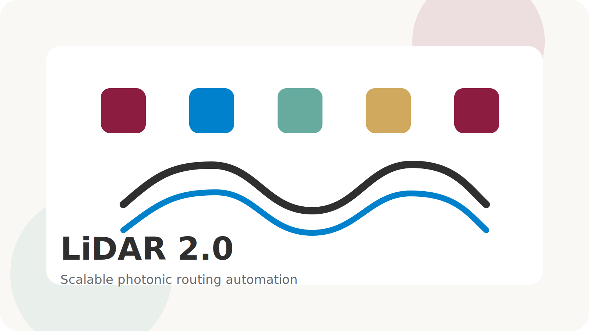

## Overview

LiDAR 2.0 focuses on one of the hardest bottlenecks in photonic CAD: detailed routing for large-scale photonic integrated circuits with realistic geometry constraints. The project is aimed at making photonic layout flows more automatic, scalable, and deployment-ready.

Instead of treating routing as a simple geometric afterthought, the framework captures photonic-specific requirements such as curvature, congestion, and large-design hierarchy. That makes it a strong example of the lab's design-automation direction.

This folder is a better long-term home for LiDAR 2.0 because routing figures, supplementary animations, and foundry-specific notes can now stay beside the project page instead of being stuffed into a central site file.

## Suggested Next Additions

- Routing benchmark figures
- Comparison tables
- Supplementary animations
- Foundry-specific notes

