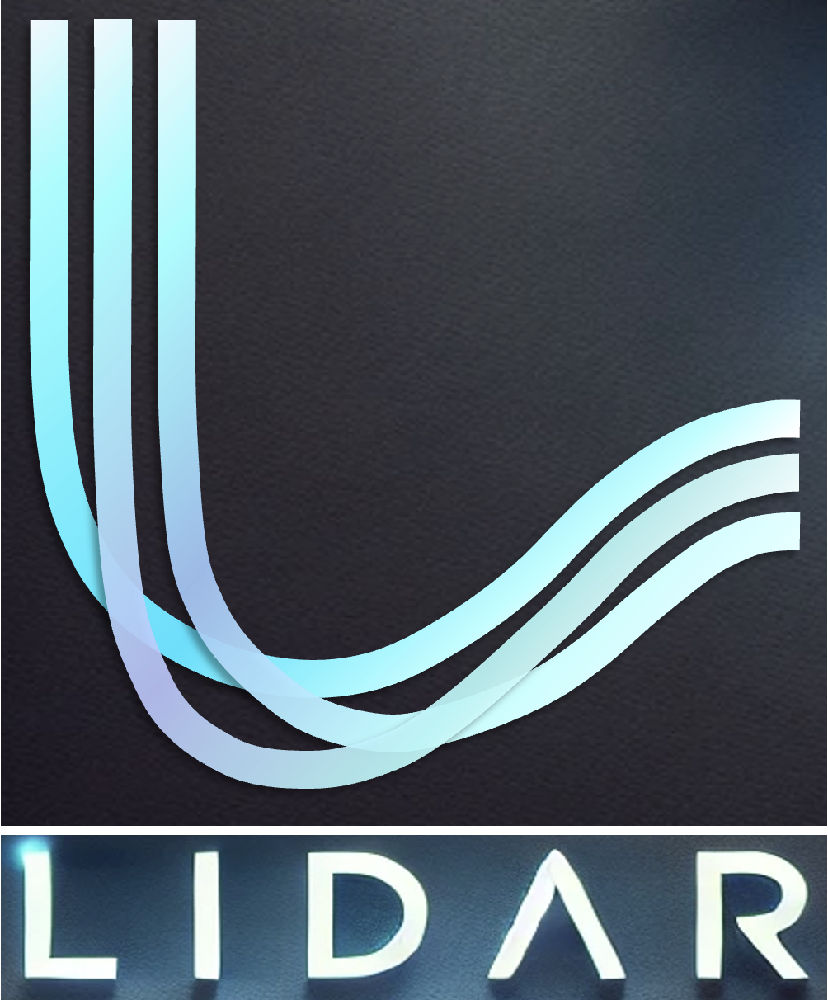
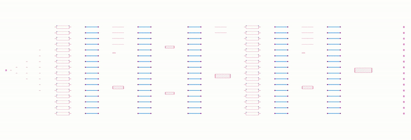

# LiDAR 2.0: Hierarchical Curvy Waveguide Detailed Routing for Large-Scale Photonic Integrated Circuits

*An EPDA stack router toolkit for automated PIC detailed routing, curvy waveguides, and conflict-resilient hierarchical routing.*

<p align="center">
  
</p>

> [!NOTE]
> **LiDAR 2.0** is the second-generation detailed router in the LiDAR toolkit. It targets large-scale photonic integrated circuits (PICs) whose layouts are too dense, too constrained, and too photonics-specific to be handled by conventional electronic routing assumptions.

<p align="center">
  
</p>

## Routing Is the Missing Layer in Photonic Design Automation

As photonic integrated circuits continue to scale, layout generation has become one of the bottlenecks in photonic design automation. Schematic capture can define connectivity, but it does not solve the physical problem of turning a circuit graph into a DRV-free layout with bends, crossings, port constraints, and congestion all respected at once. In practice, this means that large PICs still require a significant amount of manual intervention, especially when the design contains dense crossings or compact subcircuits that leave little room for detours.

That mismatch is the reason LiDAR exists. The project was not built as a generic graph router with photonic terminology attached to it. It was built to solve a genuinely photonic physical-design problem: how to generate real waveguide routes that respect minimum bend radius, crossing legality, port accessibility, and insertion-loss objectives at the same time. The first LiDAR release established this direction with a curvy-aware detailed routing engine. LiDAR 2.0 pushes that idea further by adding hierarchical routing, conflict-resilient routing order refinement, and explicit support for compact designs that would otherwise break a flat routing strategy.

> [!TIP]
> The key shift in LiDAR 2.0 is not only “more automation,” but **better routing structure**: reuse what can be reused, reserve what must remain free, and let the router reason about compact photonic subcircuits hierarchically instead of flattening everything into one global search.

## Why Electronic Routing Ideas Are Not Enough

Electronic detailed routing is often built around rectilinear wires, via constraints, and layer transitions. Photonic routing is different in a few critical ways. Waveguides are curved objects. They have bend radii. They may require crossings rather than layer changes. Their ports are not just connection points; they are physical access regions that must remain routable. In dense photonic systems, a small local choice can create a global dead end because a blocked access region or a poorly placed crossing can destroy the feasibility of the remaining nets.

LiDAR is built around this reality. Rather than forcing photonic layouts into an electronic router abstraction, it models the routing problem with curvy-aware neighbor expansion, legality checking, adaptive crossing insertion, and routing cost functions that reflect photonic design objectives. The result is a toolkit that behaves like a true EPDA router: it does not merely connect pins, it generates layouts that are meant to be fabricated.

<p align="center">
  
</p>

## The Core Idea Behind LiDAR

The original LiDAR engine introduced a grid-based, curvy-aware A* search that expands routing candidates using parametric bending geometry instead of straight Manhattan-style moves. This lets the router reason about bend legality and orientation while searching. A GridMap-based legality check filters out invalid neighbors before they enter the exploration frontier, and adaptive crossing insertion allows a waveguide to pass through an occupied region when the crossing is actually legal and useful.

<p align="center">
  
</p>

That design matters because photonic routing is not only about finding a path. It is about finding a path that can still be realized after all of the local physical rules are enforced. In that sense, LiDAR treats routing as a constrained geometric search problem rather than as a purely combinational connectivity problem. The router decides whether a bend, a detour, a crossing, or a reroute is the right move only after considering the current layout state and the photonic rules attached to it.

<p align="center">
  
</p>

## LiDAR 2.0: Hierarchical Routing for Compact and Dense Designs

LiDAR 1.0 established that curvy-aware detailed routing can be automated. LiDAR 2.0 asks a harder question: what happens when the design is so compact that a flat global routing order is no longer robust enough?

The answer is hierarchical routing. Instead of treating every connection in the chip as part of one monolithic search, LiDAR 2.0 reuses subcircuit structure, refines routing order inside groups, and preserves crossing space proactively so that later nets do not destroy the options needed by earlier ones. This makes the router much more resilient when the layout becomes congested, especially for subcircuits that appear repeatedly or that contain dense internal crossings.

Three ideas drive this improvement. Redundant-bend elimination removes unnecessary geometric complexity before it becomes a source of congestion. Crossing-space preservation keeps room available for crossings that are likely to be required later. Routing-order refinement reorders connections inside compact subcircuits so the search sees fewer dead ends and fewer expensive rip-up-and-reroute cycles.

> [!IMPORTANT]
> LiDAR 2.0 is not just a faster version of LiDAR 1.0. It is a more conflict-aware router that uses hierarchy to make compact PIC routing feasible in cases where a flat strategy becomes fragile.

<p align="center">
  
</p>

## Photonic Port Access Is a First-Class Routing Problem

A major reason PIC routing becomes difficult is that ports themselves occupy valuable routing real estate. When access regions are poorly handled, the router can easily block future nets before they are even routed. LiDAR therefore treats port access as a dedicated subproblem rather than as a byproduct of path search.

The toolkit includes port propagation, bending-aware port access region reservation, congested port spreading, and staggered access-point offsets for dense interfaces. These strategies improve accessibility around multiport components and make it easier for the router to place crossings and bends without creating avoidable conflicts. In compact layouts, this is often the difference between a successful route and a dead end.

## A Toolkit for Real PIC Workflows

LiDAR is not only a routing algorithm. It is an EPDA toolkit built around an explicit PIC intermediate representation and benchmark infrastructure. The repository includes a YAML-based PIC IR, benchmark generation scripts, router configuration files, design rule checking utilities, and post-processing support. This makes it possible to move from a netlist to a routed GDSII layout in a way that is reproducible and scriptable.

The benchmark suite is one of the most useful parts of the release. Beyond the original structured layouts, LiDAR 2.0 adds more challenging cases such as TeMPO, GWOR, and Bennes, which are specifically designed to stress hierarchical structure, crossing density, and compactness. These benchmarks are important because they expose the exact regime where photonic routers tend to fail: dense layouts with limited space and high conflict pressure.

<p align="center">
  
</p>

## What the Results Show

The main lesson from the LiDAR 2.0 evaluation is that compactness changes the routing problem qualitatively. A router that works on spacious layouts may fail when the same nets are packed into a tighter region, not because the circuit is different in topology, but because the layout now requires more disciplined conflict management. LiDAR 2.0 addresses that by combining hierarchical reuse with local search refinements, which improves both routability and insertion loss.

This is the practical value of the toolkit. It is not only able to generate routes, but to generate routes that remain viable under the conditions that matter in real PIC design: dense placement, strict bend constraints, high crossing density, and layout-specific routing pressure. In the paper, LiDAR 2.0 consistently produces DRV-free layouts and reports improved insertion loss and runtime over prior methods, including the original LiDAR formulation.

## Beyond LiDAR 2.0

The broader significance of LiDAR is that it represents a real EPDA stack component for photonics. Placement, routing, verification, and layout generation are all part of the same design flow, and detailed routing is where many promising PIC designs become practically manufacturable or fail. As photonic circuits continue to scale, we expect routing to become more central, not less.

That is why the toolkit matters beyond a single paper. LiDAR creates a reusable foundation for future EPDA work: more sophisticated hierarchy extraction, more advanced route planning, tighter co-optimization with placement, better loss models, richer DRC integration, and more realistic support for foundry-specific layout rules. In that sense, LiDAR 2.0 is both a tool and a starting point.

## Getting Started

The repository is organized so users can build benchmarks, run routing experiments, and inspect the generated layouts and logs with minimal setup. The configuration is YAML-based, which makes it easier to experiment with routing parameters such as bend radius, grid resolution, routing order, and rip-up limits. The toolkit also supports visualization during routing, making it easier to debug dense layouts and understand why a route succeeds or fails.

If you are working on photonic integrated circuits at the layout, architecture, or physical-design level, LiDAR is meant to be a practical starting point for automated detailed routing.

## Citation

If LiDAR or LiDAR 2.0 contributes to your work, please cite:

```bibtex
@inproceedings{hzhou2025lidar,
  title={LiDAR: Automated Curvy Waveguide Detailed Routing for Large-Scale Photonic Integrated Circuits},
  author={Hongjian Zhou and Keren Zhu and Jiaqi Gu},
  booktitle={International Symposium on Physical Design (ISPD)},
  year={2025}
}
```

```bibtex
@article{zhou2025lidar2,
  title={LiDAR 2.0: Hierarchical Curvy Waveguide Detailed Routing for Large-Scale Photonic Integrated Circuits},
  author={Hongjian Zhou and Haoyu Yang and Ziang Yin and Nicholas Gangi and Zhaoran Huang and Haoxing Ren and Joaquin Matres and Jiaqi Gu},
  journal={IEEE Transactions on Computer-Aided Design of Integrated Circuits and Systems},
  year={2025}
}
```
