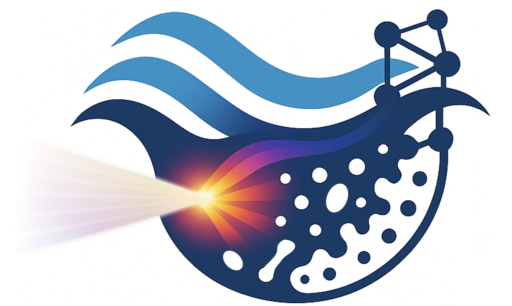
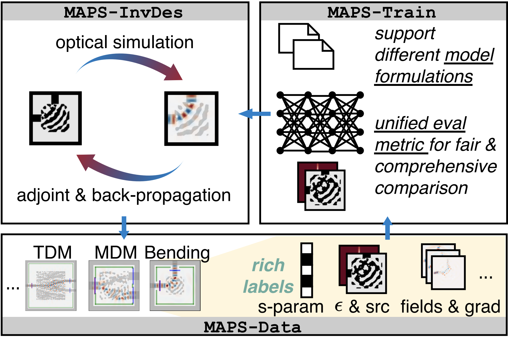
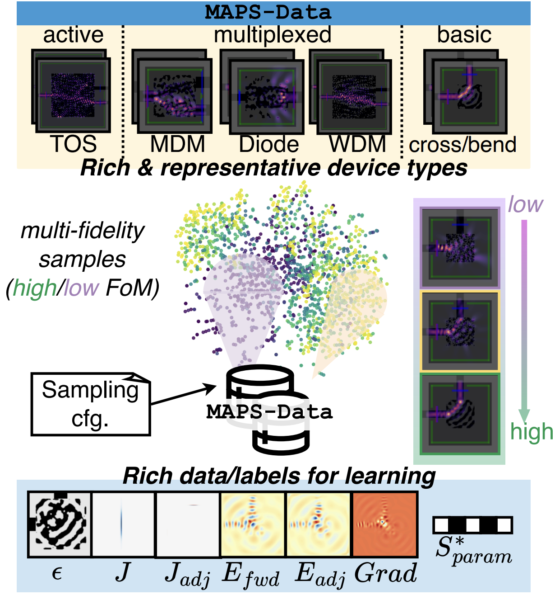
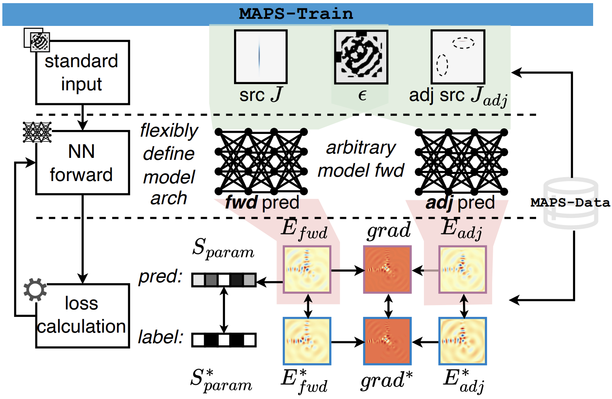
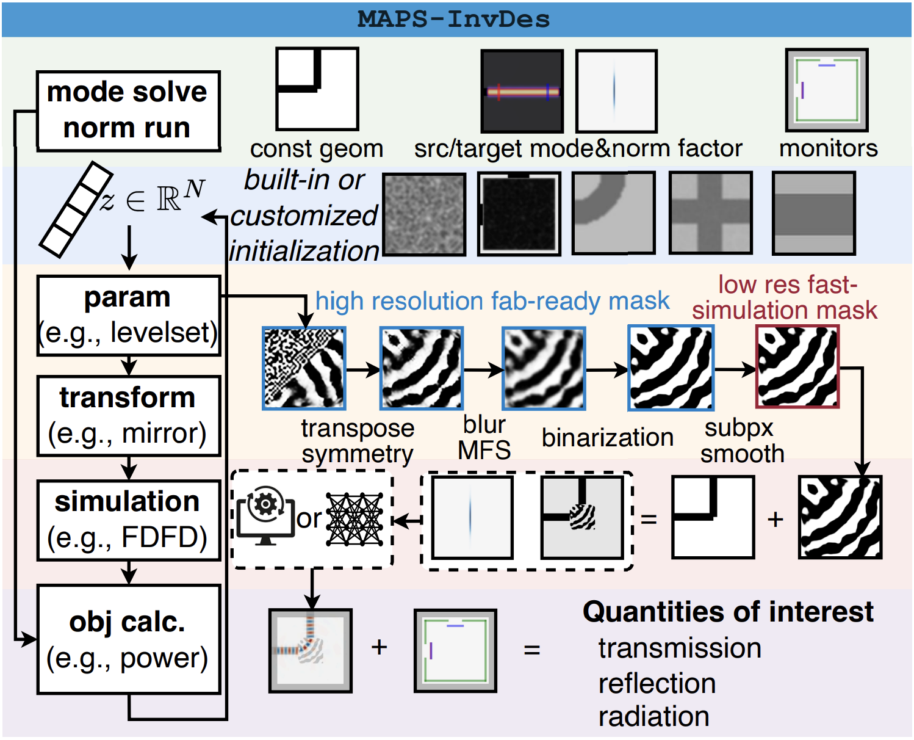

# MAPS: Multi-Fidelity AI-Augmented Photonic Simulation and Inverse Design Infrastructure

*An open research platform for differentiable photonic simulation, AI-assisted inverse design, and multiphysics co-design.*

<p align="center">
  
</p>

> [!NOTE]
> MAPS is designed as an **infrastructure layer** for computational photonics. It brings together dataset generation, AI model training, differentiable optimization, and multiphysics simulation in one modular framework.

<p align="center">
  
</p>

## Why MAPS

Computational photonics has changed rapidly over the past decade. Adjoint optimization made it practical to search high-dimensional design spaces that would have been inaccessible to manual tuning alone. GPU computing then pushed full-wave simulation toward interactive design loops, while scientific machine learning introduced new ways to approximate solvers, accelerate optimization, and learn physical priors from simulation data. These developments have made photonic design more powerful, but also more fragmented. In practice, a modern workflow often spans geometry generation, field simulation, dataset construction, model training, gradient-based optimization, and fabrication-aware validation, each implemented with its own scripts, file formats, and assumptions.

MAPS was created to reduce that fragmentation. Rather than focusing on a single solver or a single optimization method, it provides a reusable software foundation for photonic research. The goal is to make simulation, data, learning, and inverse design behave like parts of the same pipeline. This makes it easier to reproduce results, compare methods, extend existing workflows, and develop new ideas without rebuilding the surrounding infrastructure every time.

> [!TIP]
> The central idea behind MAPS is simple: **optics, learning, and optimization should live in one differentiable workflow**.

## A Unified View of the Design Loop

At a high level, MAPS treats photonic design as a computational graph. A geometry is parameterized, rasterized onto a grid, converted into material distributions, and evaluated by a physics engine. The resulting fields are then used to compute an objective, and gradients flow back through the same pipeline to update the design. In this view, simulation is not an isolated endpoint. It is one stage inside a larger optimization system.

This perspective is what makes MAPS different from a conventional simulator. It does not only answer the question "what is the field?" It also asks "how should the structure change?" and "how can we make that change robust, efficient, and compatible with downstream AI models?" The framework is therefore useful not only for inverse design, but also for generating datasets, training surrogates, studying fabrication sensitivity, and building new differentiable photonic algorithms.

## MAPS-Data: Multi-Fidelity Dataset Generation

<p align="center">
  
</p>

MAPS-Data provides an automated pipeline for constructing rich photonic datasets from simulation. The emphasis is not on collecting a single scalar label for each device, but on capturing the physical state of the system in a form that is useful for machine learning and inverse design. Depending on the application, the dataset can include forward fields, adjoint fields, S-parameters, device geometries, material maps, and optimization traces.

This matters because AI models for photonics rarely behave like standard image models. Their inputs and outputs may be complex-valued, multi-wavelength, vector-valued, or constrained by Maxwell physics. MAPS-Data is built to support that setting directly. Users can define sampling strategies, device families, and fidelity levels while preserving a consistent data interface for downstream training. The result is a dataset layer that is useful both for surrogate modeling and for physics-aware learning.

## MAPS-Train: Scientific Machine Learning for Photonics

<p align="center">
  
</p>

MAPS-Train provides the learning side of the infrastructure. It is designed for training AI models that predict photonic responses, learn compact representations, or assist optimization through learned priors. The framework supports standardized data loading, flexible model construction, and configurable loss functions that can mix data-driven supervision with physics-driven objectives.

The design choice here is deliberate: MAPS-Train should make experimentation easy without making the workflow brittle. Researchers can swap models, losses, and evaluation protocols while keeping the rest of the pipeline fixed. This is especially important in photonics, where a model that performs well on one device family or one simulation fidelity may fail under a slightly different parameterization. A shared training infrastructure makes those differences easier to isolate and study.

## MAPS-InvDes: Differentiable Inverse Design

<p align="center">
  
</p>

MAPS-InvDes is the optimization engine at the center of the framework. It supports gradient-based inverse design with flexible geometry parameterizations, physics-aware objectives, and fabrication-oriented constraints. The goal is to expose optimization as a first-class object rather than as a hidden script around a simulator. In practice, this means that users can couple differentiable simulation, parameter updates, and custom callbacks in a way that remains transparent and extensible.

Over time, MAPS-InvDes has grown beyond the original level-set inverse design workflow. It now supports continuous geometry parameterization, rectangle-based design regions, differentiable morphology operators, Gaussian-smoothed interpolation, level-set variants based on SubpixelSmoothedProjection, callback hooks, and a wider set of optimizers, including NCG and LM variants. The result is a more general optimization substrate that can support both compact academic examples and more realistic device-level workflows.

## Beyond the Original DATE 2025 Paper

The original MAPS paper introduced the main infrastructure for multi-fidelity AI-augmented photonic simulation and inverse design. Since then, the project has expanded substantially.

Recent MAPS releases added a modified version of GPU-accelerated 3D FDTD through `fdtdx`, enabling broadband adjoint optimization and larger-scale full-wave workflows. MAPS also now supports a reduced-degree-of-freedom FEM-based differentiable heat solver, which makes thermo-optical co-simulation and inverse design more practical. On the modeling side, the framework now includes 3D extrusion with configurable sidewall angle, 3D-to-2.5D effective-index simulation, native optical and thermal grids, and improved rasterization support through Tidy3d-based autogridding. The visualization stack has also been upgraded to better support 3D views, multiple design regions, and gradient plots.

These additions are important because they move MAPS from a purely electromagnetic inverse design framework toward a broader differentiable multiphysics platform. Real photonic devices rarely operate in isolation. Thermal effects, layout constraints, and fabrication variation all matter. A useful research infrastructure has to reflect that reality, not abstract it away.

> [!IMPORTANT]
> MAPS now supports both **high-fidelity physical simulation** and **fast approximate design loops**, so researchers can move between exploration, training, and verification without changing platforms.

## The Role of Multi-Fidelity Computation

Multi-fidelity design is one of the core ideas behind MAPS. Not every optimization step needs the most expensive simulation. Early exploration often benefits from fast approximations, reduced-order models, or learned surrogates. Final validation, on the other hand, requires accurate full-wave or multiphysics analysis. MAPS is built so that these different fidelities can coexist in the same workflow.

This is where the infrastructure pays off. A researcher can prototype a concept with an effective-index approximation, train a surrogate model on generated data, refine the result with adjoint optimization, and then validate it using higher-fidelity 3D simulation or thermo-optical co-simulation. By making the transition between fidelities explicit and modular, MAPS makes it easier to balance computational cost against physical accuracy.

## A Platform for Reproducible Research

A recurring problem in computational photonics is that promising methods are often difficult to reuse outside the original codebase. MAPS is designed to address that problem by separating common infrastructure from algorithm-specific logic. Grid definitions, geometry parameterization, solver interfaces, dataset formats, and optimization hooks are all exposed in a way that encourages reuse.

This makes MAPS useful not only as a research codebase, but also as a common language for the community. A new solver, a new loss function, a new geometry representation, or a new optimizer can be integrated without rewriting the entire pipeline. That modularity is what allows the framework to grow as the field evolves.

## Looking Ahead

MAPS is still evolving. The long-term direction is toward a more complete AI-native infrastructure for computational photonics, where learned models, differentiable physics, and multiphysics simulation are all part of the same optimization stack. Future development will continue to push toward larger-scale 3D inverse design, tighter optical-thermal co-design, more expressive geometry parameterizations, richer benchmarking, and more robust integration with AI-assisted workflows.

We also see opportunities in electronic-photonic co-design, uncertainty-aware optimization, distributed design at scale, and foundation-model-style representations for photonic devices and simulations. Our goal is not just to release a software package, but to provide a durable platform that helps the community explore new ideas faster and more reproducibly.

## Citation

If MAPS is useful in your work, please cite:

```bibtex
@inproceedings{ma2025maps,
  title={{MAPS: Multi-Fidelity AI-Augmented Photonic Simulation and Inverse Design Infrastructure}},
  author={Pingchuan Ma and Zhengqi Gao and Meng Zhang and Haoyu Yang and Mark Ren and Rena Huang and Duane S. Boning and Jiaqi Gu},
  year={2025},
  booktitle={Design, Automation and Test in Europe Conference (DATE)},
  url={https://arxiv.org/abs/2503.01046},
}
```

```text
Pingchuan Ma, Zhengqi Gao, Meng Zhang, Haoyu Yang, Mark Ren, Rena Huang, Duane S. Boning, and Jiaqi Gu,
"MAPS: Multi-Fidelity AI-Augmented Photonic Simulation and Inverse Design Infrastructure,"
Design, Automation and Test in Europe Conference (DATE), Lyon, France, Mar. 31 - Apr. 02, 2025.
```
