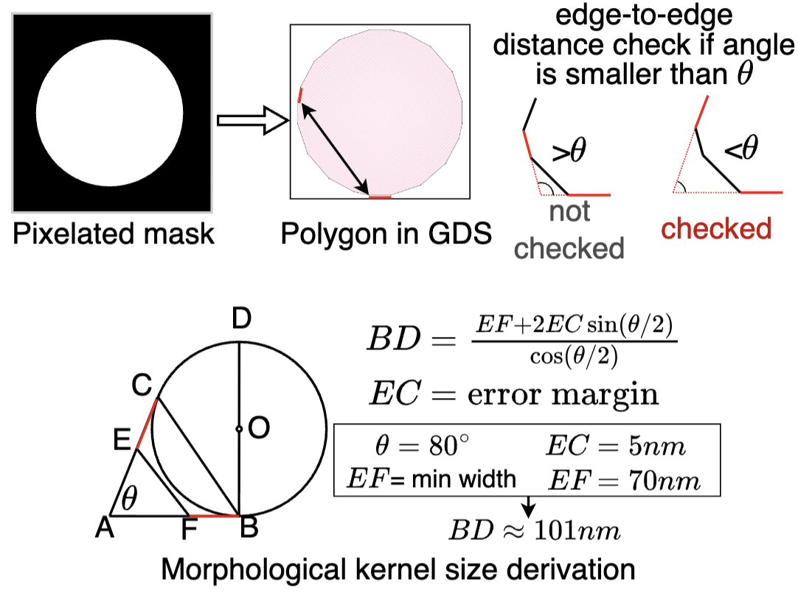
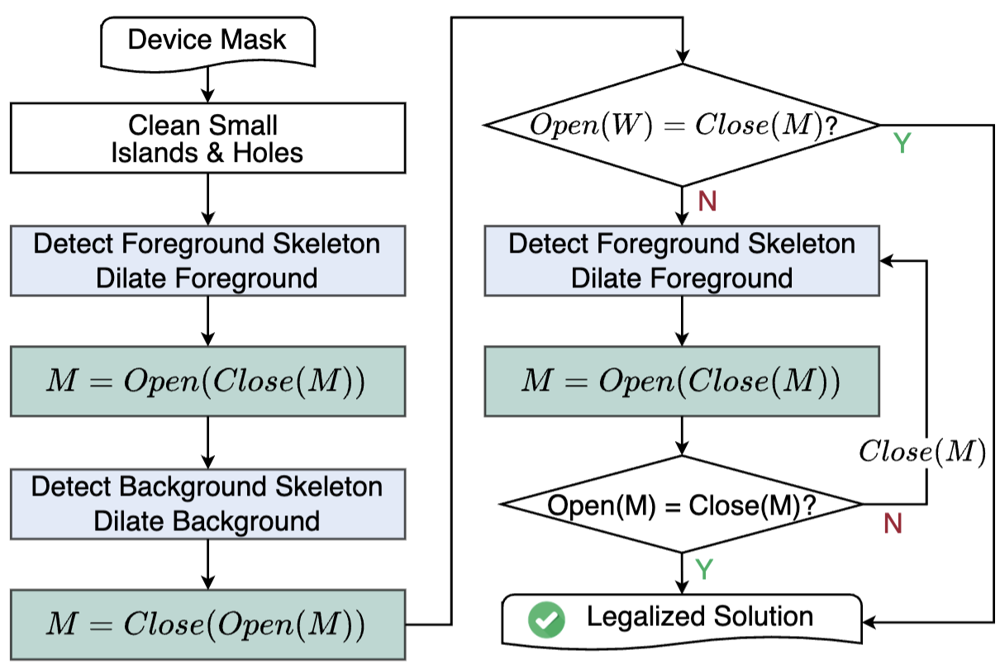
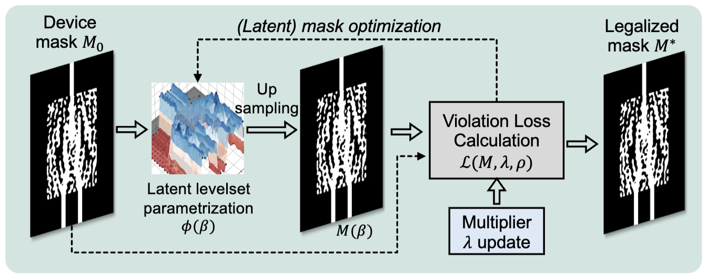
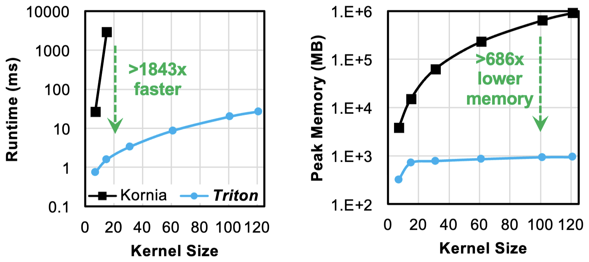
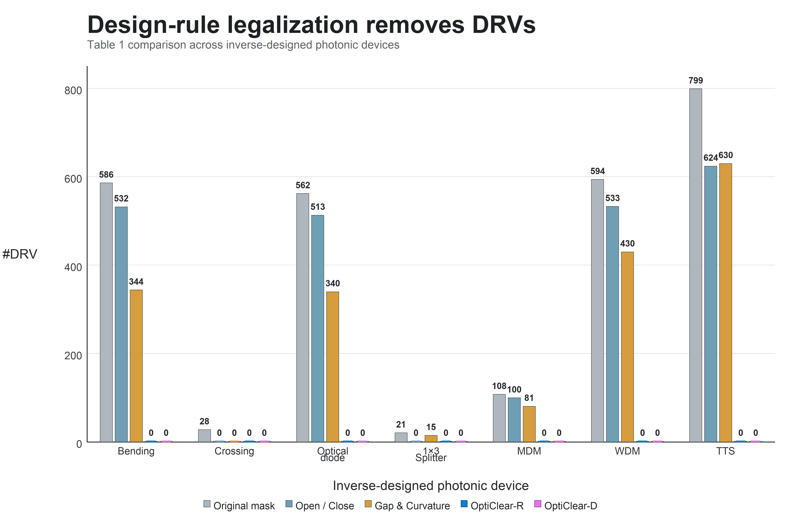
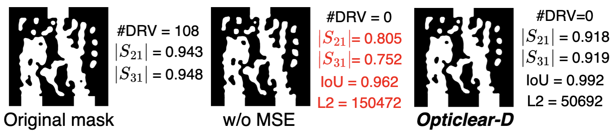

# OptiClear

## Differentiable Curvilinear Design Rule Legalization for Inverse-Designed Photonic Devices

Photonic inverse design can discover compact, high-performance devices with complex freeform geometries that are difficult or impossible to design manually.

However, there is a critical obstacle between an optimized photonic design and foundry tape-out:

> The inverse-designed layout may **not satisfy strict manufacturing design rules**.

Narrow gaps, thin bridges, sharp notches, and dense curvilinear features can remain even when fabrication-aware regularization is applied during inverse design.

OptiClear addresses this missing **design-rule legalization stage** for inverse-designed photonic devices.

---

# The Design-to-Manufacturing Gap

Inverse-designed photonic layouts are fundamentally different from conventional electronic IC layouts.

Electronic design-rule legalization typically assumes Manhattan geometries and relies on operations such as edge pushing, polygon snapping, and local shape modification.

Inverse-designed photonic devices, however, contain highly irregular **curvilinear geometries** whose optical functionality can be extremely sensitive to small geometric perturbations.

<p align="center">
  
</p>

A local repair that removes one design-rule violation can easily introduce another—or significantly degrade optical performance.

This raises a key question:

> How can we make a freeform photonic layout **strictly design-rule compliant** while changing its geometry as little as possible?

OptiClear was developed to solve this problem.

---

# OptiClear: Legalization in the Pixel Domain

The central idea of OptiClear is simple:

> **Legalize the mask before converting it into GDS polygons.**

OptiClear operates directly on the binary or grayscale masks naturally produced by topology optimization and level-set inverse design.

Instead of relying on Manhattan geometric rules, OptiClear uses **mathematical morphology** to characterize minimum-width and minimum-spacing violations in arbitrary curvilinear layouts.

Morphological **opening** detects weak or undersized foreground structures, while **closing** identifies narrow gaps and small holes.

A rule-clean mask should become stable under both operations.

This **morphological stationarity** provides the foundation for two complementary legalization engines:

* **OptiClear-R:** fast, rule-based legalization
* **OptiClear-D:** differentiable, minimum-distortion legalization

---

# OptiClear-R: Efficient Rule-Based Legalization

OptiClear-R provides a fast legalization engine based on iterative morphology-guided geometric repair.

It identifies regions where opening and closing conflict and separately repairs the silicon foreground and background gaps.

<p align="center">
  
</p>

For the foreground, skeleton-guided dilation strengthens thin silicon bridges and weak connections.

For the background, narrow gaps and fragile necks are widened to satisfy spacing requirements.

The process iterates until opening and closing reach a consistent stationary state.

The result is an efficient rule-based legalizer capable of transforming complex curvilinear layouts into **design-rule-clean masks**.

---

# OptiClear-D: Minimum-Distortion Legalization

Rule-based legalization is efficient, but conservative geometric repair can modify more of the device than necessary.

This is especially problematic for inverse-designed photonic devices, where a tiny perturbation near a critical interference region can significantly change optical behavior.

OptiClear-D therefore formulates legalization as a **differentiable constrained optimization problem**.

<p align="center">
  
</p>

Instead of asking:

> *How should we geometrically repair every violation?*

OptiClear-D asks:

> **What is the smallest mask modification that makes the entire device rule compliant?**

The device is represented using a differentiable level-set parameterization, while an augmented Lagrangian formulation drives the mask toward morphological stationarity.

This allows OptiClear-D to automatically decide whether a local violation should be resolved by widening a gap, merging nearby silicon, or making another minimal geometric adjustment.

The result is a legal mask that remains as close as possible to the original high-performance design.

---

# GPU-Accelerated Differentiable Morphology

Differentiable morphology becomes computationally expensive for high-resolution photonic masks.

Large structuring kernels require evaluating many neighboring pixels, and conventional implementations can quickly become both memory- and compute-intensive.

OptiClear introduces customized **Triton GPU kernels** for high-resolution differentiable opening and closing.

<p align="center">
  
</p>

Rather than explicitly materializing every local neighborhood, the kernels directly traverse active offsets and perform fused min/max reductions.

On the evaluated benchmarks, this implementation achieves approximately:

* **1843× speedup**
* **686× lower memory consumption**

compared with the evaluated third-party differentiable morphology implementation.

This acceleration makes optimization-based legalization practical for large, nanometer-resolution photonic masks.

---

# Design-Rule Legalization in Action

OptiClear was evaluated on a diverse collection of inverse-designed photonic devices, including:

* Waveguide bends
* Crossings
* Optical diodes
* 1×3 splitters
* Mode-division multiplexers
* Wavelength-division multiplexers
* Thermally tunable switches

<p align="center">
  
</p>

Under the primary **70 nm minimum-width and minimum-spacing rules**, both OptiClear-R and OptiClear-D reduce the number of true design-rule violations to **Zero.**

This highlights an important distinction between fabrication-aware inverse design and explicit legalization.

Regularization can **discourage** problematic geometry.

OptiClear **enforces** a rule-clean final layout.


OptiClear-R provides faster rule-based correction, while OptiClear-D generally achieves higher geometric and optical fidelity through minimum-distortion optimization.

Together, they provide a practical **efficiency–fidelity tradeoff** for photonic design legalization.

---

# Why Minimum Distortion Matters

For photonic devices, geometric similarity alone does not guarantee functional similarity.

> A layout can look almost identical to the original design and still exhibit substantially different optical behavior.

A small modification near a port, resonant feature, or interference-critical region can matter far more than a larger modification elsewhere.

This makes legalization fundamentally different from simply maximizing pixel-wise or polygon-wise geometric similarity.

By explicitly minimizing unnecessary mask distortion, OptiClear-D helps preserve the functional structures discovered by inverse design while still satisfying strict manufacturing rules.

<p align="center">
  
</p>


---

# Toward Design-Rule-Aware Photonic Design Automation

OptiClear introduces an explicit legalization stage into the electronic-photonic design automation (EPDA) flow.

Rather than expecting fabrication-aware inverse design alone to produce a tape-out-ready layout, OptiClear separates two complementary objectives:

* **Inverse design** discovers high-performance photonic structures.
* **Design-rule legalization** guarantees that the final layout satisfies manufacturing constraints.

This creates a practical path from:

> **Inverse Design → Design-Rule Legalization → GDS → Foundry Tape-Out**

Beyond post-design repair, OptiClear's differentiable formulation also opens the door to future **end-to-end design-rule-aware inverse design**, where foundry constraints, optical sensitivity, fabrication models, and device optimization can be integrated into a unified differentiable design flow.

---

## Citation

If OptiClear is related to your research, please cite:

```bibtex id="9fge6n"
@inproceedings{zhou2027opticlear,
  title     = {{OptiClear: Differentiable Curvilinear Design Rule Legalization for Inverse-Designed Photonic Devices}},
  author    = {Hongjian Zhou and Haoyu Yang and Nicholas Gangi and Zhaoran Huang and Jiaqi Gu},
  booktitle = {IEEE/ACM Asia and South Pacific Design Automation Conference (ASP-DAC)},
  year      = {2027},
  url       = {https://arxiv.org/abs/2607.03632}
}
```

```text id="wxypf7"
Hongjian Zhou, Haoyu Yang, Nicholas Gangi, Zhaoran Huang, and Jiaqi Gu, "OptiClear: Differentiable Curvilinear Design Rule Legalization for Inverse-Designed Photonic Devices," IEEE/ACM Asia and South Pacific Design Automation Conference (ASP-DAC), 2027.
```
