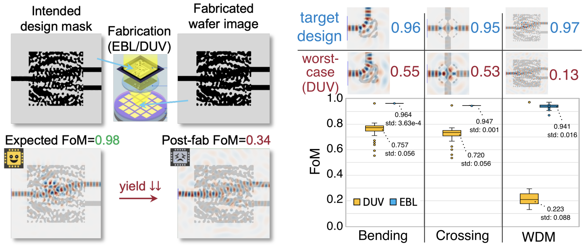
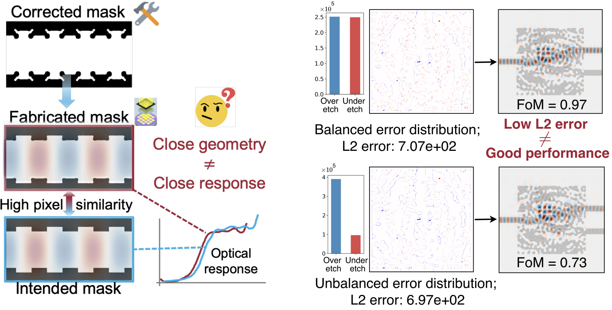
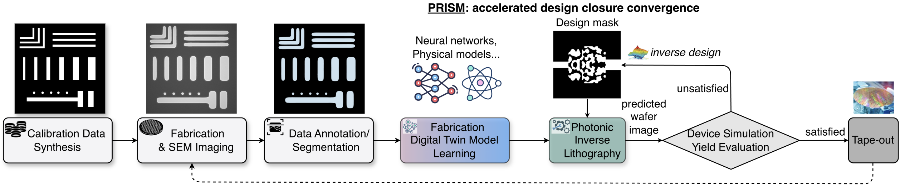
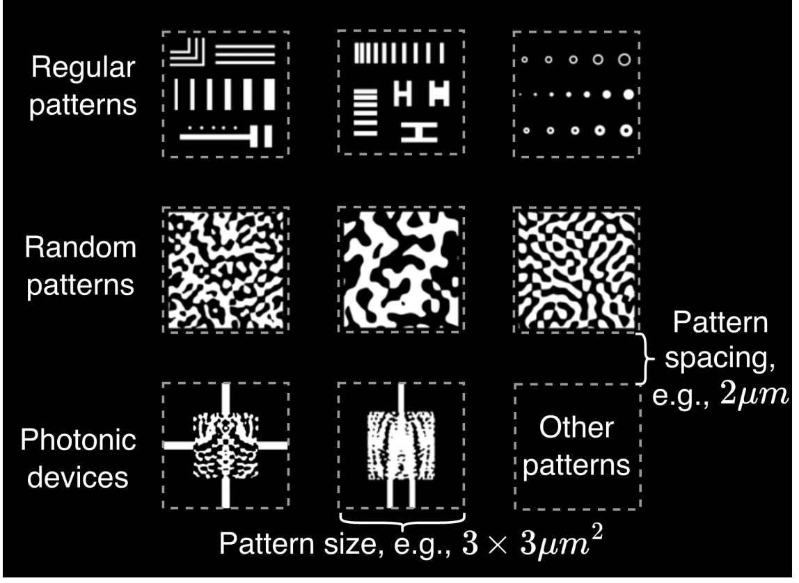
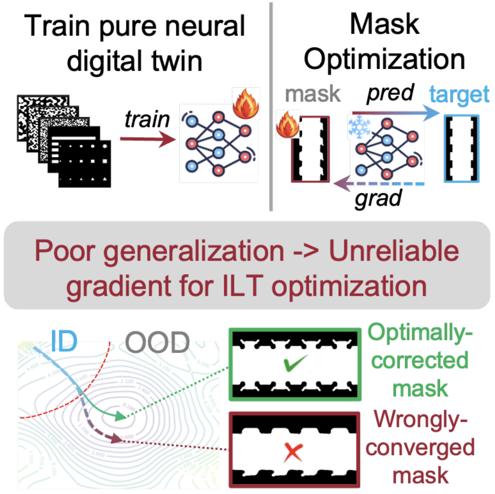
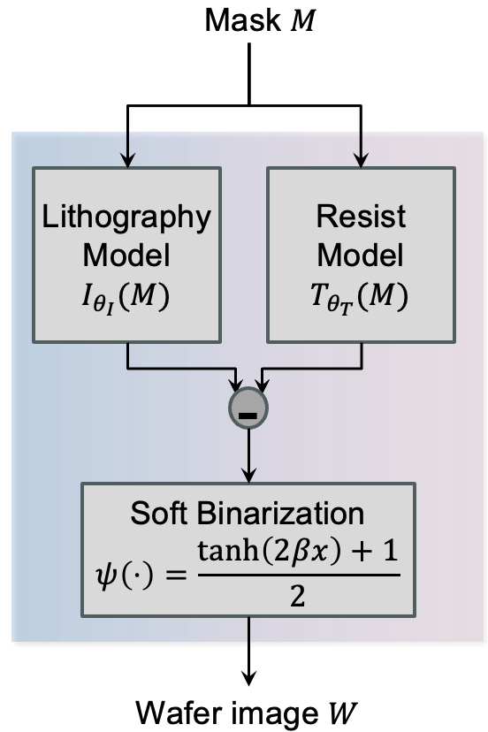
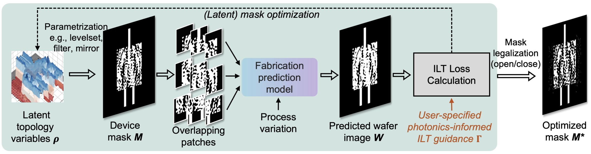
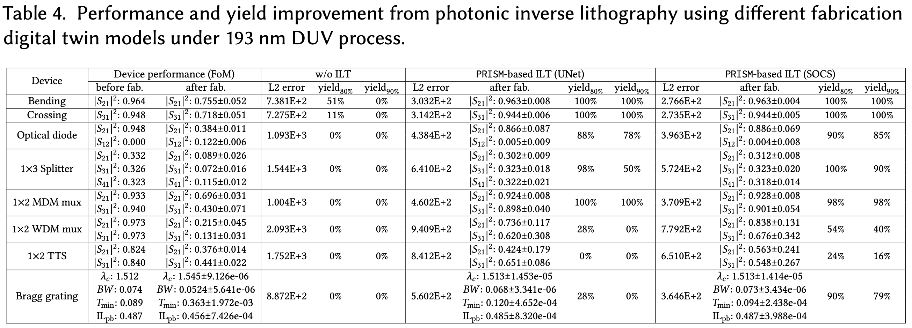

# PRISM
## Photonics-Informed Inverse Lithography for Manufacturable Inverse-Designed Photonic Integrated Circuits

Inverse-designed photonic integrated circuits (PICs) have fundamentally changed how nanophotonic devices are created. Instead of manually designing waveguides and resonators, inverse design automatically discovers compact, high-performance structures that would be nearly impossible for human designers to invent.

However, there is one major obstacle preventing these devices from being deployed at scale.

## The Design-to-Manufacturing Gap

Inverse-designed photonic devices often contain extremely fine, irregular, subwavelength structures. Although these patterns are optimal in electromagnetic simulation, they are also highly sensitive to lithography and fabrication imperfections.

Even small distortions during fabrication—such as edge rounding, line bridging, linewidth bias, or over-/under-etching—can dramatically alter optical interference, resonance, and scattering, causing large performance degradation or complete device failure.

<p align="center">
  
</p>

Unlike electronic ICs, where mature Design-for-Manufacturing (DFM) techniques such as Optical Proximity Correction (OPC) and Inverse Lithography Technology (ILT) are standard foundry services, photonic integrated circuits still lack an effective manufacturing correction flow.

As a result, today's photonic designers often rely on conservative design rules, repeated tape-outs, or manual tuning, making inverse-designed photonics difficult to manufacture reliably.

PRISM was developed to bridge this long-standing simulation-to-fabrication gap.

---

# PRISM: Closing the Loop Between Design and Manufacturing

PRISM is the first **photonics-informed inverse lithography framework** specifically designed for inverse-designed photonic integrated circuits.

Conventional mask optimization in DFM only optimizes the mask to match the target geometry.
However, for photonics, where light closely interacts with the nano-structures, geometry matching is not enough to ensure the device performance.
Critical features are sensitive to small perturbation, but geometry matching treats all distortions as equally important, which is unaware of the **design intent**.
<p align="center">
  
</p>

Instead of treating mask correction as a purely geometric optimization problem, PRISM optimizes masks guided by **photonic functionality**.

Its goal is simple:

> Preserve the optical response after fabrication—not merely the printed geometry.

<p align="center">
  
</p>

The entire workflow forms a closed-loop design-manufacturing optimization framework consisting of three tightly coupled components:

- **Data-efficient fabrication calibration and dataset acquisition**
- **Physics-grounded differentiable fabrication digital twin**
- **Photonics-informed inverse lithography optimization**

Together, these components transform highly sensitive inverse-designed layouts into manufacturable, high-yield photonic devices.

---

# Data-Efficient Fabrication Learning

Accurate fabrication models normally require extensive SEM characterization and expensive process calibration.

PRISM dramatically reduces this requirement by generating a compact yet highly informative calibration reticle containing:

- Regular photonic primitives
- Randomized curvilinear structures
- Cropped inverse-designed devices

These complementary calibration patterns efficiently capture lithography and etching behavior while minimizing fabrication cost.

<p align="center">
  
</p>

Rather than requiring thousands of fabricated structures, PRISM learns an accurate fabrication model from a carefully designed small calibration dataset.

---

# Physics-Grounded Fabrication Digital Twin

At the core of PRISM is a differentiable fabrication digital twin.

Instead of treating fabrication as a black-box neural network, which has unreliable gradient for ILT optimization, especially on OOD patterns, PRISM incorporates the underlying lithography physics directly into the model.
<p align="center">
  
</p>

Depending on the fabrication process, the digital twin combines

- Hopkins/SOCS optical imaging models for DUV lithography
- Physics-based PSF models for electron-beam lithography
- Learnable fabrication parameters calibrated from measured data

<p align="center">
  
</p>

This hybrid formulation provides two critical advantages:

- Better generalization under limited calibration data
- Stable gradients for inverse lithography optimization

These stable gradients are essential because ILT continuously generates mask patterns that differ significantly from the original calibration data.

---

# Photonics-Informed Inverse Lithography

Traditional ILT focuses on minimizing geometric printing errors.

Unfortunately, in photonics:

> Close geometry does **not** necessarily imply close optical performance.

Some regions of a device dominate optical interference while others are relatively insensitive.

PRISM therefore introduces **photonics-informed optimization objectives** by incorporating electromagnetic adjoint sensitivity into mask optimization.
Only one adjoint gradient solve for the ideal design is needed and reused throughout the ILT.

<p align="center">
  
</p>

Instead of correcting every pixel equally, PRISM automatically prioritizes fabrication accuracy in the regions that matter most for optical functionality.

This allows manufacturing corrections to directly preserve device performance rather than simply matching geometry.

---

# Manufacturing-Aware Optimization in Action

The optimization process is fully differentiable.

Starting from an inverse-designed layout, PRISM repeatedly

1. predicts the fabricated wafer pattern,
2. evaluates manufacturing errors optionally weighted by design-intent-aware adjoint sensitivity,
3. updates the mask.

The entire optimization loop runs automatically using gradient descent.

<p align="center">
  
</p>

*Optimization process of PRISM. The mask gradually evolves to compensate for fabrication distortions while preserving optical functionality.*

---

# Significant Yield Improvement

PRISM was evaluated on a diverse collection of inverse-designed photonic devices, including

- waveguide crossings
- optical diodes
- multiplexers
- wavelength demultiplexers
- Bragg gratings
- mode multiplexers
- thermally tunable switches
- 3D grating couplers

under both

- Electron Beam Lithography (EBL)
- 193 nm Deep Ultraviolet (DUV) lithography

<p align="center">
  
</p>

Across challenging manufacturing conditions, PRISM consistently

- improves post-fabrication optical performance,
- dramatically increases fabrication yield,
- reduces geometric printing error,
- enables inverse-designed devices previously considered impractical for production DUV processes.

---

# Toward Manufacturable Inverse-Designed Photonics

PRISM introduces a new design methodology that tightly couples photonic design automation with semiconductor manufacturing.

Rather than treating fabrication as a post-processing step, PRISM incorporates manufacturing directly into the optimization loop, allowing designers to create devices that are both high-performance **and** manufacturable.

As inverse-designed photonics becomes increasingly important for optical interconnects, AI accelerators, quantum computing, and integrated sensing, PRISM provides an essential technology for translating computationally optimized photonic devices into reliable fabricated hardware.

---

## Citation

If PRISM is related to your research, please cite:

```bibtex
@article{zhou2026prism,
  title={{PRISM: Photonics-Informed Inverse Lithography for Manufacturable Inverse-Designed Photonic Integrated Circuits}},
  author={Hongjian Zhou and Haoyu Yang and Nicholas Gangi and Tianle Xu and Rena Huang and Jiaqi Gu},
  year={2026},
  journal={ACM Transaction on Design Automation of Electronic Systems (TODAES)},
  url={https://arxiv.org/abs/2602.15762},
}
```

```text
Hongjian Zhou, Haoyu Yang, Nicholas Gangi, Tianle Xu, Rena Huang, and Jiaqi Gu, "PRISM: Photonics-Informed Inverse Lithography for Manufacturable Inverse-Designed Photonic Integrated Circuits", ACM Transaction on Design Automation of Electronic Systems (TODAES), 2026.
```