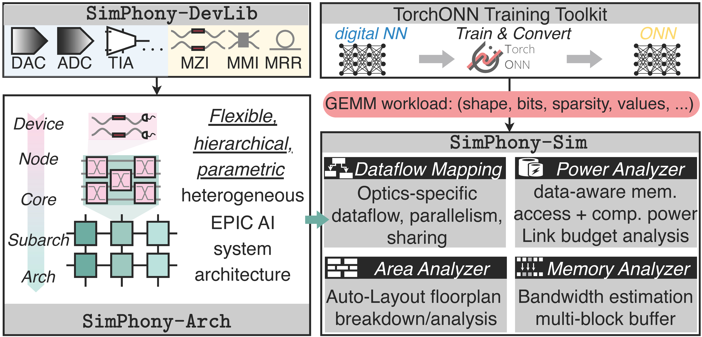
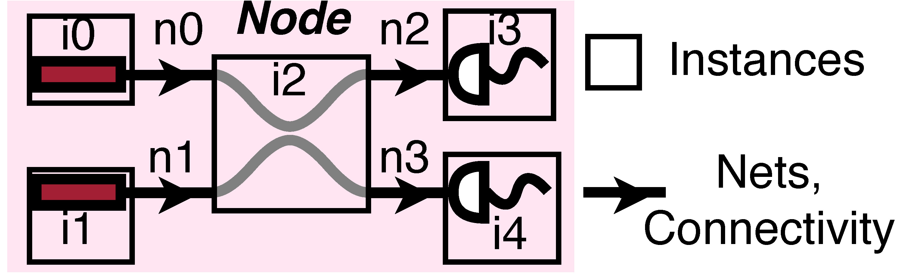
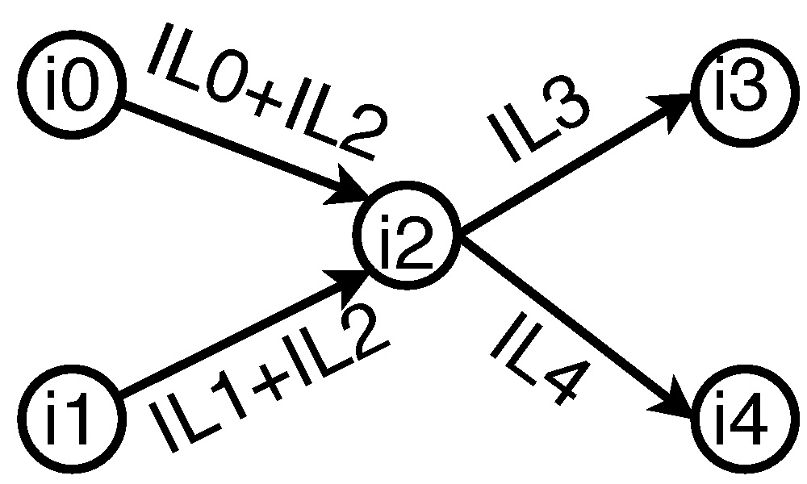
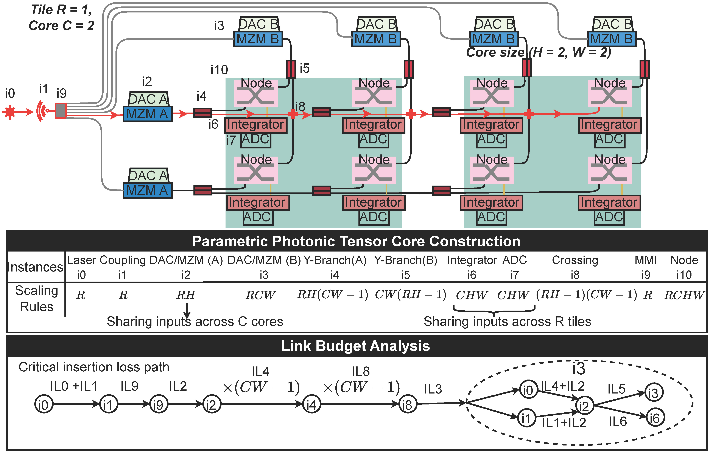
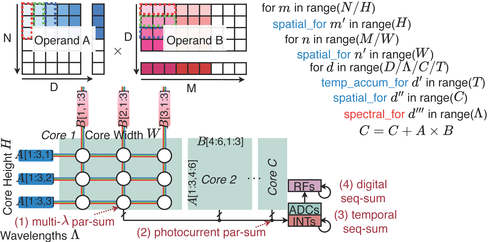
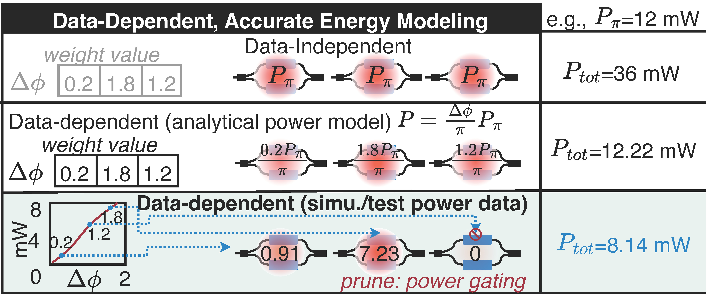
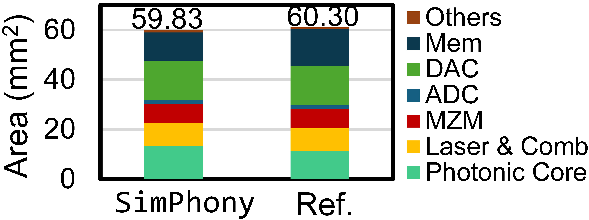
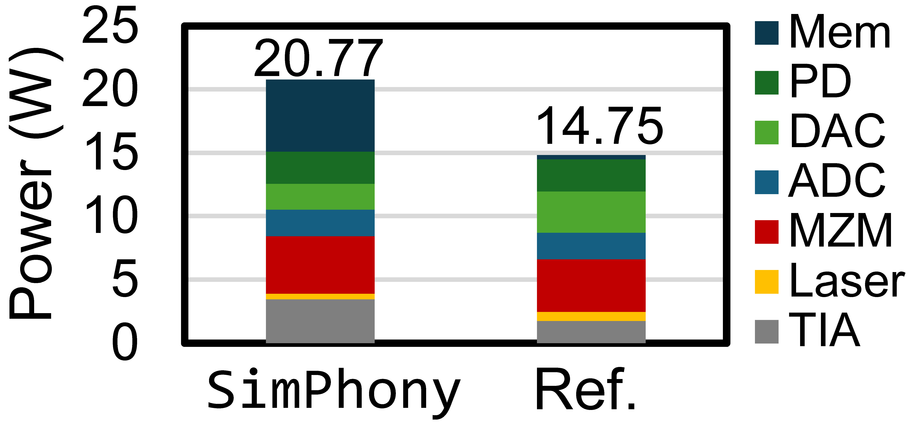

# SimPhony: Cross-Layer Modeling and Simulation for Heterogeneous Electronic-Photonic AI Systems

*An open infrastructure for device-circuit-architecture co-simulation, optics-aware dataflow modeling, and end-to-end performance evaluation of EPIC accelerators.*

<p align="center">
  
</p>

> [!NOTE]
> **SimPhony** is built to answer a simple but difficult question: *what is the performance of an electronic-photonic AI system after all device, circuit, and architecture effects are taken into account?*

<p align="center">
  
</p>

## Why SimPhony

Electronic-photonic integrated circuits (EPICs) promise a new class of AI hardware, but they also introduce a modeling problem that conventional simulators were never designed to solve. A photonic accelerator is not defined by one abstraction layer alone. Device physics determines insertion loss, latency, and energy. Circuit topology determines how those devices interact. Architecture determines how cores are tiled, reused, and scheduled. Workloads determine how the system is exercised. A change at any one layer can propagate through the entire stack.

That cross-layer coupling is precisely why EPIC design is difficult to evaluate. A layout change can affect optical path loss, which changes laser budget, which affects system energy. A different dataflow can change how many modulators or detectors are reused, which changes area and latency. A memory hierarchy choice can shift the bandwidth bottleneck even when the photonic core itself stays fixed. In practice, these effects are tightly coupled, yet most simulation workflows still treat them separately.

SimPhony was created to close that gap. It provides a unified framework for modeling heterogeneous electronic-photonic AI systems across devices, circuits, and architecture. Instead of assuming a fixed abstraction boundary, SimPhony keeps the coupling visible and makes it programmable. That design choice is what enables the framework to evaluate realistic EPIC systems on common workloads while preserving the photonic details that matter.

> [!TIP]
> The main idea in SimPhony is not just “simulate a photonic accelerator.” It is to **compose device-level realism with architecture-level evaluation** in one reusable software stack.

## A Cross-Layer Design Philosophy

The core philosophy behind SimPhony is that photonic AI systems should be modeled as a hierarchy, not as a single monolithic block. At the bottom of the stack are device primitives with energy, area, latency, and insertion-loss characteristics. These primitives are composed into circuits. Circuits are then reused to build photonic cores. Cores are then tiled into architectures. Finally, architectures are mapped to workloads through dataflow and memory modeling.

This hierarchy is more than an organizational convenience. It is the mechanism that makes reuse explicit. A dot-product unit can be defined once and then scaled across a larger architecture. A core can be reused inside a tile. A device response can be reused across different configurations when the underlying parameters remain the same. SimPhony exposes this reuse structure directly in the configuration language, so the same design can be analyzed at multiple granularities without rewriting the model from scratch.

<p align="center">
  
</p>

## Photonic Building Blocks as First-Class Objects

One of the most useful ideas in SimPhony is that the user defines a system from reusable blocks rather than from a flat list of equations. A node or circuit primitive can be described once, and the framework can then scale that primitive into a larger photonic core or a tiled architecture. This is especially important for dynamic photonic tensor core designs, where a small building block is replicated many times across the system.

<p align="center">
  
</p>

The paper’s dynamic array-style tensor core case study illustrates this point well. SimPhony allows the designer to define architecture parameters such as tiles, cores, and dot-product nodes, and then describe how those nodes connect through symbolic scaling rules. That means the architecture can be expanded without manually specifying every repeated connection. In other words, the model preserves the design structure that hardware architects care about, while still providing device-level accounting for the physical quantities that matter in the final evaluation.

<p align="center">
  
</p>

> [!IMPORTANT]
> SimPhony is not just a netlist viewer. It is a **symbolic system model** that understands reuse, scaling, and hierarchical composition in EPIC accelerators.

## Dataflow Is Not an Afterthought

Electronic systems often treat dataflow as a scheduling detail. In photonic systems, dataflow is much more fundamental. The way information is encoded, broadcast, accumulated, and reused can change optical path length, modulation count, laser budget, memory pressure, and total system energy. SimPhony therefore models dataflow explicitly and supports the stationary modes needed for photonic AI accelerators.

This is where optics-specific behavior becomes especially important. Photonic computation offers parallelism that is not limited to the standard spatial and temporal dimensions familiar from electronic accelerators. Wavelength, mode, and broadcast-style reuse can all matter in a realistic design. SimPhony captures this by modeling photonic domain parallelism directly in the latency and energy calculations, rather than collapsing it into an electronic approximation.

<p align="center">
  
</p>

## More Than Static Energy Numbers

A common weakness in early accelerator estimators is that they treat device energy as a fixed constant. That approximation can be sufficient for a rough comparison, but it breaks down when the system depends on device operating point, optical power distribution, insertion loss, or workload-dependent activity. SimPhony goes further by supporting data-aware energy modeling, where device energy can depend on the actual computation.

<p align="center">
  
</p>

This matters because real EPIC systems do not operate at a single abstract energy point. The laser budget depends on the optical path. The optical path depends on the architecture and layout. The architecture depends on the dataflow and reuse strategy. If the energy model ignores those dependencies, the result may look precise while being physically misleading. SimPhony instead keeps these interactions visible and allows them to feed into the performance estimate.

> [!NOTE]
> The framework also integrates with **PyTorch-ONN** for the training layer, so a model can be trained first, exported, and then compiled into a workload representation that SimPhony can use for end-to-end performance modeling.

## Area, Loss, and Memory Are Part of the Same Story

SimPhony does not restrict itself to throughput or energy. It also supports layout-aware area estimation, insertion-loss analysis, and memory modeling. These quantities are not independent in a photonic system. Area affects routing and routing affects loss. Loss affects power. Power affects energy. Memory bandwidth and hierarchy affect data movement, which in turn affects latency and utilization.

<p align="center">
  
</p>

<p align="center">
  
</p>

The advantage of a cross-layer framework is that these dependencies can be evaluated together. Rather than reporting an isolated device metric, SimPhony can produce a more complete system-level report that includes area breakdown, energy breakdown, insertion-loss analysis, and memory effects. That is the level of visibility required when comparing heterogeneous EPIC designs on real workloads.

## A Bridge Between Training and System Modeling

One of the project’s most practical design choices is its integration with the optical neural network training stack. In a realistic workflow, the training layer and the system modeling layer should not be isolated. A trained model should be exportable into a workload representation that the system simulator can consume, so that accuracy-oriented modeling and hardware-oriented evaluation remain connected.

That is the role SimPhony is meant to play. It sits downstream of model training and upstream of hardware exploration. A user can train or import an optical neural network, map the resulting workload into an EPIC architecture, and then evaluate the resulting performance under different device assumptions, dataflows, and memory hierarchies. This makes the framework useful not only for architecture studies, but also for hardware/software co-design.

## Why the Toolkit Matters

SimPhony is useful because it makes a hard problem reproducible. If every EPIC research group builds its own private estimator, then the field spends too much time comparing incompatible numbers. If the modeling stack is open, configurable, and cross-layer, then different devices, cores, dataflows, and workloads can be compared on a more consistent basis. That is exactly the kind of infrastructure a young hardware field needs.

The same point also explains why SimPhony is broader than a single paper. The framework is already a foundation for future design-space exploration, but its abstraction layer is general enough to grow in several directions. More rigorous physical-layer simulation can be added without changing the architecture layer. Multi-chiplet modeling can be introduced without abandoning the existing dataflow abstractions. Distributed-system support can be layered on top of the current core and memory model. Optical interconnect modeling can extend the same cross-layer logic into system-scale communication.

## Looking Ahead

The long-term roadmap for SimPhony is to make it the system-level substrate for electronic-photonic AI design. The next step is deeper design-space exploration, where the framework can help compare not only a fixed set of architectures, but entire families of EPIC systems under varying device, circuit, and workload assumptions. Just as important are more rigorous physical-layer models, including improved optical effects, better layout awareness, and more detailed link-budget analysis.

We also expect the framework to evolve toward multi-chiplet and distributed-system settings, where optical interconnects become central rather than peripheral. That direction raises new questions about communication cost, memory movement, partitioning, and network topology, but those are exactly the kinds of questions a cross-layer simulator should be able to answer. In that sense, SimPhony is not an endpoint. It is the beginning of a more complete EPIC design infrastructure.

## Citation

If SimPhony is useful in your work, please cite:

```bibtex
@inproceedings{yin2025simphony,
  title={{SimPhony: A Device-Circuit-Architecture Cross-Layer Modeling and Simulation Framework for Heterogeneous Electronic-Photonic AI System}},
  author={Ziang Yin and Meng Zhang and Amir Begovic and Rena Huang and Jeff Zhang and Jiaqi Gu},
  year={2025},
  booktitle={ACM/IEEE Design Automation Conference (DAC)},
  url={https://arxiv.org/abs/2411.13715},
}
```

```text
Ziang Yin, Meng Zhang, Amir Begovic, Rena Huang, Jeff Zhang and Jiaqi Gu,
"SimPhony: A Device-Circuit-Architecture Cross-Layer Modeling and Simulation Framework for Heterogeneous Electronic-Photonic AI System",
ACM/IEEE Design Automation Conference (DAC), 2025.
```
